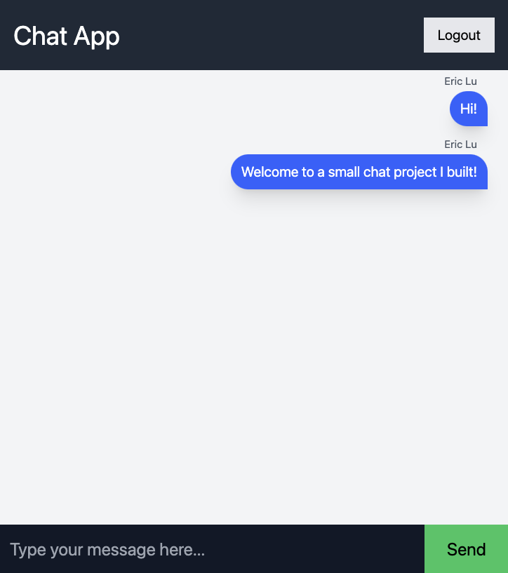

# chat-app

This basic messaging application allows you to read and send messages to other users in real time!

Whenever users send a message, it's saved to a Firestore database, which upon updating, alerts other users to render a new React component. 

# technologies:

- React
- Firebase
- Tailwind CSS

# learnings:

- Working with Firebase's authentication and Firestore databases
- Using React hooks to fetch and send data to a Firestore collection with addDoc, query, and querySnapshot
- Styling with Tailwind CSS, including custom styles and extending utility classes with @apply
